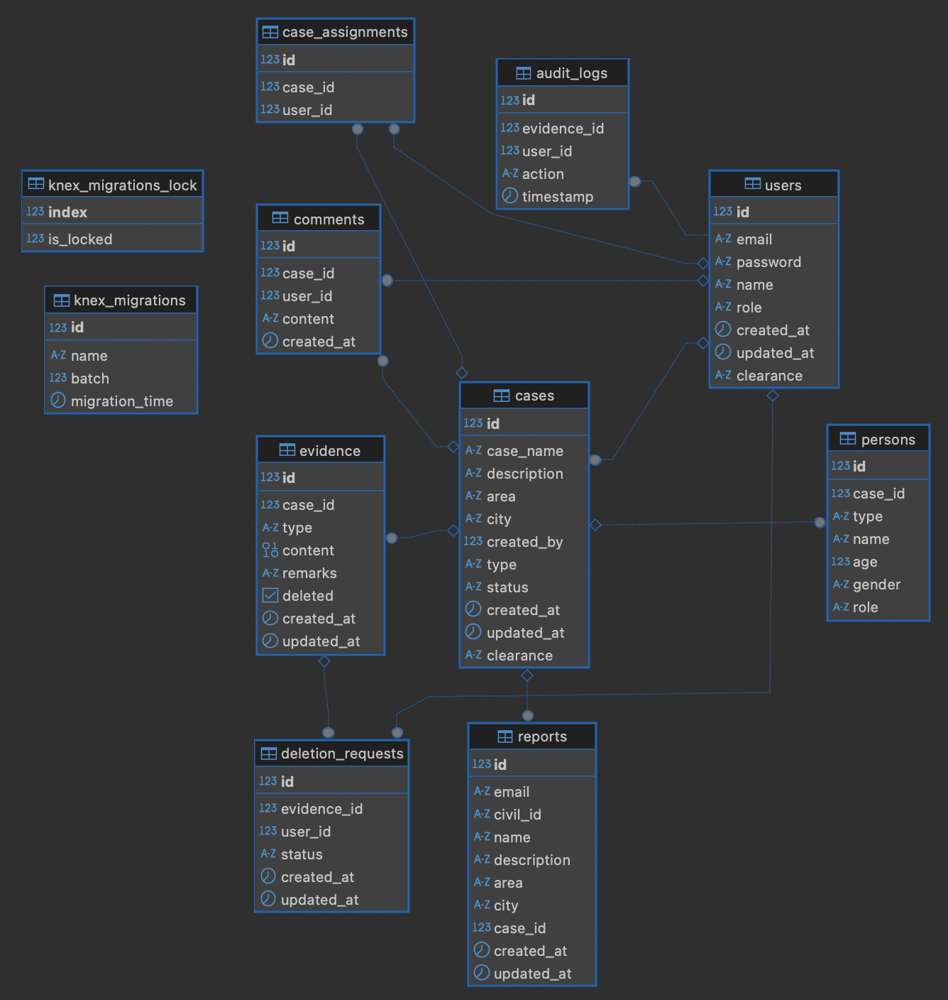

## Start the API and DB with One Command
1. Copy sensetive environment variables such as `SENDGRID_API_KEY` provided in the submission email into the `.env` file in this directory.
2. Execute the command `docker-compose up -d` after ensuring your terminal is in the directory `ghazi-rihal-codestacker/packages/backend`.

## Email Notifications
To recieve email notifications to your preferred email address, update the variable `COMMUNITY_EMAIL` in the `.env` file the base of this directory, then start `docker-compose up` the project.

The hosted instance currently sends emails to `dccms.recipient@alcham.me`, which is hosted on Zoho Mail. The login credentials for this account were provided in the challenge submission email.

## Highlights
- Input validation with zod
- DB relational integrity with foreign keys deployed wherever possible
- DB migrations `src/configuration/migrations` and seeds based on the provided example `src/configuration/seeds`
- Completed all bonus challenges

## DB Structure

